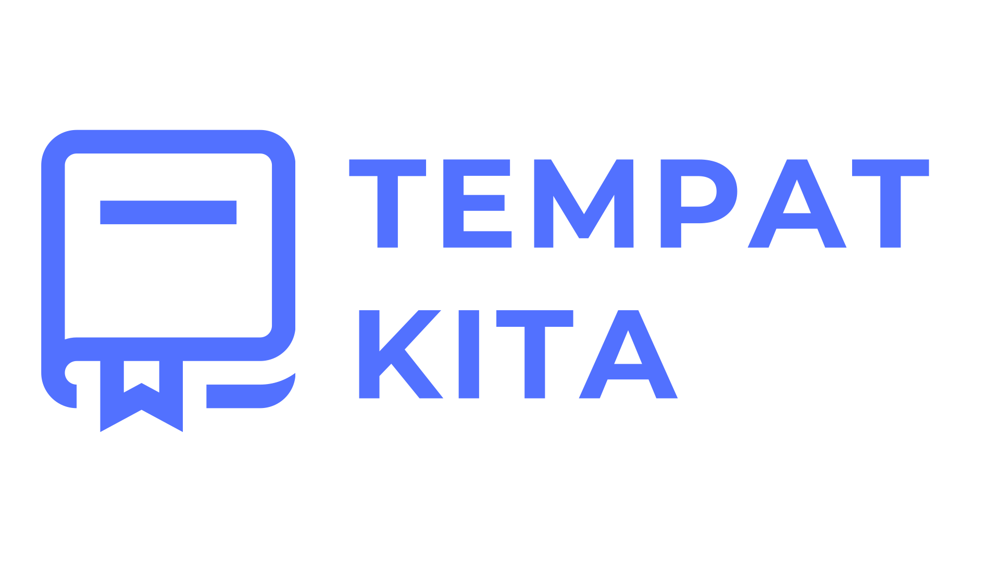

# TEMPAT KITA

  
  
  
  
  
  
  
  

## About TEMPAT KITA
Website online course gratis ini memiliki tujuan utama untuk mendemokratisasi pendidikan. Kami percaya bahwa pengetahuan dan keterampilan seharusnya tidak terbatas oleh batasan ekonomi atau geografis. Dengan menyediakan akses pendidikan berkualitas tanpa biaya, kami berkomitmen untuk meningkatkan aksesibilitas dan memastikan bahwa siapa pun, di mana pun, dapat mengakses sumber daya pembelajaran kami. Selain itu, kami ingin memberdayakan individu untuk mengembangkan keterampilan baru, membuka peluang di dunia pekerjaan atau memperkaya hobi mereka. Melalui platform ini, kami mendukung konsep pembelajaran seumur hidup, mendorong orang untuk terus belajar dan berkembang. Kami juga ingin memfasilitasi kolaborasi dan pertukaran pengetahuan antara peserta kursus, membangun komunitas belajar yang inklusif dan berdaya. Dengan tujuan ini, kami berharap dapat memberikan dampak positif pada perkembangan pribadi dan profesional setiap individu yang bergabung dengan kami.

## Uses asset
- Admin Template By [Ankit Hingarajiya](https://github.com/dropways)

## MIT License

Copyright (c) 2023 Albany Siswanto

Permission is hereby granted, free of charge, to any person obtaining a copy
of this software and associated documentation files (the "Software"), to deal
in the Software without restriction, including without limitation the rights
to use, copy, modify, merge, publish, distribute, sublicense, and/or sell
copies of the Software, and to permit persons to whom the Software is
furnished to do so, subject to the following conditions:

The above copyright notice and this permission notice shall be included in all
copies or substantial portions of the Software.

THE SOFTWARE IS PROVIDED "AS IS", WITHOUT WARRANTY OF ANY KIND, EXPRESS OR
IMPLIED, INCLUDING BUT NOT LIMITED TO THE WARRANTIES OF MERCHANTABILITY,
FITNESS FOR A PARTICULAR PURPOSE AND NONINFRINGEMENT. IN NO EVENT SHALL THE
AUTHORS OR COPYRIGHT HOLDERS BE LIABLE FOR ANY CLAIM, DAMAGES OR OTHER
LIABILITY, WHETHER IN AN ACTION OF CONTRACT, TORT OR OTHERWISE, ARISING FROM,
OUT OF OR IN CONNECTION WITH THE SOFTWARE OR THE USE OR OTHER DEALINGS IN THE
SOFTWARE.
